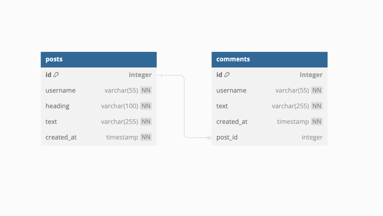

# Post.me - Blogging Platform (backend part)
This is the application, where after short registration you're able to make your own posts, write comments
to any user's posts, rate posts and comment and much more!

## Status - IN DEVELOPMENT

## Key moments
1. **Access token authentication:** Just register and get your pass to the app
2. **Creating Post:** All authenticated users are able to submit blog posts
3. **Creating Comment:** All authenticated users are able to comment any posts
4. **Rate any record:** All authenticated users are able to like/dislike posts or comments
5. **Search for posts:** All the users are able to search any posts by tags or without them 
6. **Sort the posts:** All the users are able to sort search results
7. **Get specific post by id:** All users are able to get specific post with comments
8. **Admin security:** There is the admin, that has more abilities than typical user, including getting app meta info and ability to ban any user
9. **Security Measures:** Implemented security measures to protect against common vulnerabilities

## Development stage
1. User module - CREATED
2. Auth module - CREATED
3. Post module - CREATED
4. Role module - CREATED
5. Post rate module - CREATED
6. Tag module - CREATED
7. Comment module - CREATED
8. Comment rate module - CREATED
9. Ban module - IN PROGRESS
10. Event module - IN PROGRESS

## Tech stack
* Java 11
* Spring
* Spring boot
* Spring MVC
* Spring data
* Spring security
* Postgres
* Maven
* JUnit

## DB schema
