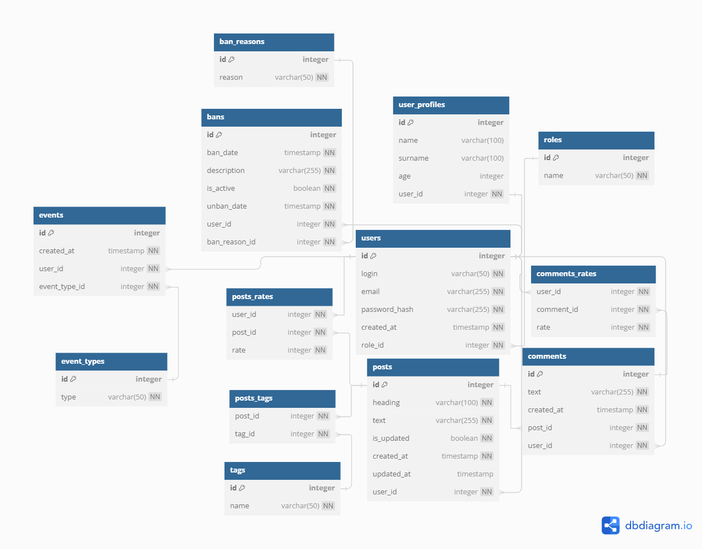

# Post.me - Simple Blogging Platform (backend part)

## Status - IN DEVELOPMENT

## Key moments
1. **Public Accessibility:** The platform is accessible to the public without the need for user accounts
2. **Creating Post:** All users are able to submit blog posts without requiring any registration
3. **Creating Comment:** All users are able to comment any posts
4. **Display Posts:** All the posts are in a continuous feed on the main page
5. **SPA Design:** The app is designed as a Single Page Application for a smooth and interactive user experience
4. **Post Details Page:** All users are able to click on a post to view its details on a dedicated page
5. **User-Friendly Interface:** There is an intuitive and user-friendly interface for easy navigation and interaction
7. **Security Measures:** Implemented basic security measures to protect against common vulnerabilities

## DB schema

